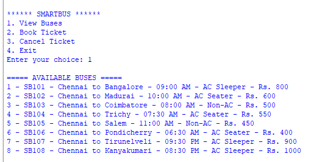
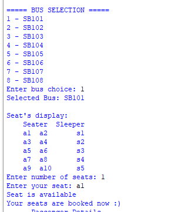
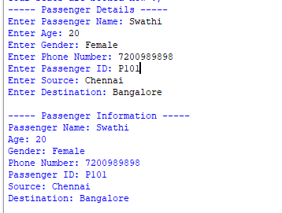
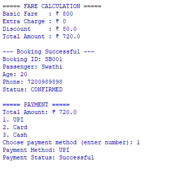
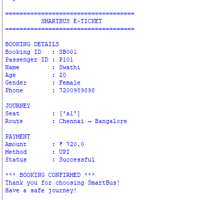
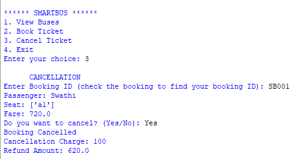

# 🚌 SmartBus – Python Ticket Booking System

## 📌 Project Overview

SmartBus is a console-based Python application that simulates a bus ticket booking system.

The system allows users to view available buses, select a bus, choose seats, enter passenger details, calculate fares, select a payment method, generate an e-ticket, and cancel bookings.

---

## 🎯 Objectives

- To develop a practical Python-based bus ticket booking system.
- To apply fundamental Python programming concepts in a real-world application.
- To implement user input and validation.
- To manage bus, seat, passenger, and booking information.
- To calculate fares and simulate payment.
- To generate a formatted e-ticket.
- To implement ticket cancellation.

---

## ✨ Features

### 🚌 1. Bus Information

Displays available buses with:

- Bus number
- Source
- Destination
- Departure time
- Bus type
- Fare

### 🎫 2. Bus Selection

Allows the user to select a bus from the available buses.

### 💺 3. Seat Management

Allows users to:

- View available seats
- Select seats
- Prevent duplicate seat selection
- Validate the number of seats

### 👤 4. Passenger Details

Collects passenger information such as:

- Passenger name
- Age
- Gender
- Phone number
- Passenger ID
- Source
- Destination

### 💰 5. Fare Calculation

Calculates the total fare based on:

- Basic fare
- Number of selected seats
- Discount

A 10% discount is applied in the current implementation.

### 💳 6. Payment

Provides three payment options:

- UPI
- Card
- Cash

The payment status is simulated as successful after selecting a valid payment method.

### 🎟️ 7. E-Ticket Generation

Generates a formatted e-ticket containing:

- Booking ID
- Passenger details
- Passenger ID
- Selected seats
- Journey details
- Total amount
- Payment method
- Payment status

### ❌ 8. Ticket Cancellation

Allows the user to:

- Enter a booking ID
- View booking information
- Cancel the booking
- Calculate cancellation charge
- Calculate refund amount
- Update booking status

---

## 🐍 Python Concepts Used

The project applies the following Python concepts:

- Variables
- Input and Output
- Conditional Statements
- `if`, `elif`, and `else`
- `for` loops
- `while` loops
- Lists
- Dictionaries
- User-defined functions
- Function parameters
- Return values
- Exception handling using `try-except`
- Input validation
- String methods

---

## ⭐ Important Python Concepts Implemented

### 1. User-Defined Functions

The project is divided into multiple functions to make the program organized and easier to maintain.

Functions used include:

```python
main_menu()
bus_information()
bus_selection()
seat_management()
passenger_details()
booking()
fare_calculation()
payment()
ticket_display()
cancellation()

## 🖥️ Project Screenshots

### 1. Main Menu



---

### 2. Bus Information



---

### 3. Booking Process



---

### 4. Fare and Payment



---

### 5. E-Ticket



---

### 6. Cancellation


